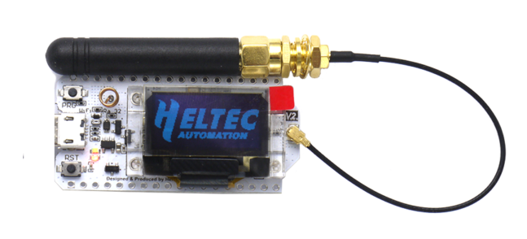

  1. 그릇찾기
  스마트한 IoT디바이스를 만들기위해 다양한 맛과 영양을 겸비한 최고의 음식(Firmware)를 담을 좋은 그릇을 찾는 마음으로 개발보드를
  구글링하다 보니 Heltec사의   Wifi LoRa 32라는 놈을 만났다. 
	디바이스가 세상과 소통하기 위해 스마트폰 만한 것이 없다.
	IoT 디바이스는 가능하면 스마트폰과 친해야한다.
	그러기 위해서 WiFi, Bluetooth 무선기능을 가진 개발보드가 필요하다.
	이것저것 찾다가 Espressif사의 ESP32 기반의 다양한 기능에 OLED 디스플레이와 LoRa Wan기능도 덤으로 갖고 있는 놈으로 당분간 나의 
  좋은 그릇 역할을 기대해 본다.
	
  2. 주방과 조리도구?
	그릇은 찾았고 이제는 좋은 음식을 만들기위한 조리환경(주방과 조리도구?)을 꾸며야 한다.
	우선 VSCode에 PlatformIO를 올려서 Firmware 개발을 하고, Python, Html, JavaScrip, JSON등을 이용해서 웹과 앱등을 만들어 볼까한다.
	
  3. 식자재?
	좋은식자재는 좋은음식의 필수 조건이다. 개발은 맨땅에 헤딩식으로 할 수도 있겠지만, 많은 훌륭한 선구자들이 남겨놓은 개발 소스들을
  활용하는 것이 좋겠다. 식자재 그대로 이미 훌륭한 음식일 수도 있지만, 내 입맛에 맞게 손을 봐야 원하는 음식이 될 수 있으니깐..
	
준비가 되었으니 음식을 만들고 그릇에 담아서 세상에 내어 보자. 

	1. 그릇 살펴보기
	
	

	• CE Certificate;
	• Microprocessor: ESP32 (dual-core 32-bit MCU + ULP core), with LoRa node chip SX1276/SX1278;
	• Micro USB interface with a complete voltage regulator, ESD protection, short circuit protection, RF shielding, and other protection measures;
	• Onboard SH1.25-2 battery interface, integrated lithium battery management system (charge and discharge management, overcharge protection, battery power detection, USB / battery power automatic switching);
	• Integrated WiFi, LoRa, Bluetooth three network connections, onboard Wi-Fi, Bluetooth dedicated 2.4GHz metal 3D antenna, reserved IPEX (U.FL) interface for LoRa use;
	• Onboard 0.96-inch 128*64 dot matrix OLED display, which can be used to display debugging information, battery power, and other information;
	• Integrated CP2102 USB to serial port chip, convenient for program downloading, debugging information printing;
	• Support the Arduino development environment;
	• We provide ESP32 + LoRaWAN protocol Arduino® library, this is a standard LoRaWAN protocol that can communicate with any LoRa gateway running the LoRaWAN protocol. In order to make this code running, a unique license is needed. it can be found on this page;
	• With good RF circuit design and basic low-power design (sleep current ≤800uA), it is convenient for IoT application vendors to quickly verify solutions and deploy applications.
	
	출처: <https://heltec.org/project/wifi-lora-32/> 
	
	1. 주방과 조리도구세팅
	VSCode 설치
	PlatformIO 올리기
	
	2. 첫음식 조리하기
	BLE_uart  
	3. 담아서 내어보기
